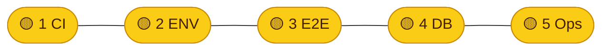

# Launch-Checkliste (Go / No-Go)

**Zweck:** Fünf klare Kriterien, die erfüllt sein müssen, bevor das Produkt als „live“ gilt — plus **aktueller Stand** aus Sicht des Repos (ohne Zugriff auf eure Vercel-/Railway-Dashboards).  
**Letzte inhaltliche Anker im Repo:** CI-Workflows, `README.md`, `backend/railway.toml`, `frontend/vercel.json`, `.env.example`.

---

## Ampel-Legende (auf einen Blick)

| Symbol | Bedeutung |
| :----: | --------- |
| 🟢 | **Grün** — Kriterium erfüllt, für Launch OK |
| 🟡 | **Gelb** — im Repo vorbereitet / plausibel, **Prod oder Dashboard noch verifizieren** |
| 🔴 | **Rot** — blockiert Launch, muss behoben werden |

---

## Schnell-Ampel (aktueller Stand)

> **Gesamt:** 🟡 **No-Go für „Launch feierlich“**, bis die gelben Punkte im Team auf 🟢 stehen (Dashboard + Prod-Smoke).

---

## Die 5 Go/No-Go-Kriterien

| # | Kriterium | 🟢 **Go** | 🔴 **No-Go** |
|---|-----------|-----------|--------------|
| **1** | **Grüne Pipeline & Qualitätsriegel** | Auf `main` ist **`CI passed`** grün; bei PRs derselbe Standard. Optional: Branch-Protection mit Required Check (siehe `README.md`). | Merge auf `main` ohne grüne CI oder bekannte flaky Builds. |
| **2** | **Produktions-Umgebung & Geheimnisse** | Vercel + Railway: alle Prod-Variablen gesetzt, konsistent zu `.env.example` / `.env.local`-Konvention (Supabase, `NEXT_PUBLIC_API_URL`, `ANTHROPIC_API_KEY`, Omi falls nötig, ISR-Secrets). **Kein** Service-Role-Key im Frontend-Build. | Platzhalter-URLs, fehlende Keys, Dev-Keys auf Prod, „ENV später“. |
| **3** | **E2E: Frontend → API → Supabase** | Öffentliche App + Kernflows gegen **Prod**-Supabase; API **`/health`** = HTTP 200; CORS/HTTPS für echte Frontend-Domain ok. | 4xx/5xx, falsche `NEXT_PUBLIC_API_URL`, CORS-Fehler in Prod. |
| **4** | **Datenbank & Storage** | `supabase/`-Migrationen + Storage/RLS auf **Prod** angewendet und smoke-getestet; Backup/Recovery bewusst entschieden. | Schema-Drift, unsichere Policies, fehlende Buckets. |
| **5** | **Betrieb & async Jobs** | Railway-Healthcheck (`/health` in `backend/railway.toml`); bei Nutzung der Pipeline: **Celery** + Redis stabil; Logs/Incident-Verantwortung **1 Zeile** dokumentiert. | Worker aus, Stau ohne Monitoring, niemand weiß wo Logs sind. |

---

## Aktueller Status (bitte im Team gegen Prod verifizieren)

| Ampel | Kriterium | Kurzbegründung |
| :---: | --------- | -------------- |
| 🟡 | **1 CI / Qualität** | `ci.yml` + **`CI passed`** vorhanden. Branch-Protection? → GitHub prüfen. `cov-fail-under: 5` im Backend-Job (README nennt teils höhere Ziele) — Pipeline 🟢, Testtiefe bewusst einstufen. |
| 🟡 | **2 ENV / Secrets** | `.env.example` ist stimmiges Zielbild. Ob Vercel/Railway live befüllt sind → **Dashboard abhaken**. |
| 🟡 | **3 E2E Erreichbarkeit** | Architektur + `README.md` stimmig. **🟢** erst nach **öffentlichem** Smoke-Test. |
| 🟡 | **4 DB / Storage** | `supabase/` + Skripte im Repo. **🟢** erst wenn **Prod**-Schema/Policies = Repo. |
| 🟡 | **5 Betrieb / Worker** | Railway + `/health` definiert; Celery in Doku. Worker/Redis in Prod? → **Team bestätigen**. |

### Hinweise aus dem Repo

| Ampel | Thema |
| :---: | ----- |
| 🟡 | **Vercel-Deploy:** `.github/workflows/deploy-vercel.yml` — Job `wait-for-ci` wartet **nicht** technisch auf grünes CI; bei Auto-Deploy Risiko kennen oder Workflow nachziehen. |

---

## Nach Launch (1 Zeile)

Datum / Version / verantwortliche Person, wenn alle fünf Kriterien 🟢 **Go** sind: _______________________
